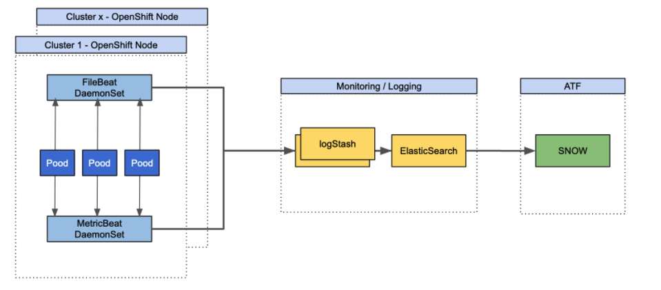

# Openshift Monitoring

This document describe the files used to monitor Openshift clusteurs with ***MetricBeat*** and ***FileBeats***.

### Prerequisites

So you should have an OpenShift 4.6+ cluster (or a Kubernetes one but it's trickier to setup) with the different features enabled:

> If you don't have cli on your machine please go to those urls : 
    <br>
      ` oc : ` [oc-cli](https://mirror.openshift.com/pub/openshift-v4/clients/oc/4.6/)


# Monitoring Architecture
The Monitoring solution is described here :


> ***MetricBeat*** : is monitoring solution developped by elstic to periodically collect metrics from the operating system and from services running on the server. Metricbeat takes the metrics and statistics that it collects and ships them to the output that you specify, such as Elasticsearch or Logstash.

> ***FileBeat*** : is a logging solution that monitors the log files or locations that you specify, collects log events, and forwards them either to Elasticsearch or Logstash for indexing.

# MetricBeat:
It will be launched as daemondSet on the clusteur with the following configuration :
```
$ cat metricbeat-openshift.yml
---
apiVersion: v1
kind: ConfigMap
metadata:
  name: metricbeat-daemonset-config
  namespace: kube-system
  labels:
    k8s-app: metricbeat
data:
  metricbeat.yml: |-
    metricbeat.config.modules:
      # Mounted `metricbeat-daemonset-modules` configmap:
      path: ${path.config}/modules.d/*.yml
      # Reload module configs as they change:
      reload.enabled: false

    metricbeat.autodiscover:
      providers:
        - type: kubernetes
          scope: node
          node: ${NODE_NAME}
          templates:
            - condition:
                contains:
                  kubernetes.namespace: openshift-dns
              config:
                - module: coredns
                  metricsets:
                    - stats
                  period: 300s
                  hosts: ["https://${data.host}:9154"]
                  ssl.verification_mode: none
                  bearer_token_file: /var/run/secrets/kubernetes.io/serviceaccount/token
            - condition:
                contains:
                  kubernetes.labels.app: kube-controller-manager
                  kubernetes.namespace: openshift-kube-controller-manager
              config:
                - module: kubernetes
                  enabled: true
                  metricsets:
                    - controllermanager
                  hosts: [ "https://${data.host}:10257" ]
                  bearer_token_file: /var/run/secrets/kubernetes.io/serviceaccount/token
                  ssl.verification_mode: none
                  period: 300s
            - condition:
                contains:
                  kubernetes.labels.app: openshift-kube-scheduler
                  kubernetes.namespace: openshift-kube-scheduler
              config:
                - module: kubernetes
                  enabled: true
                  metricsets:
                    - scheduler
                  hosts: [ "https://${data.host}:10259" ]
                  bearer_token_file: /var/run/secrets/kubernetes.io/serviceaccount/token
                  ssl.verification_mode: none
                  period: 300s
        - type: kubernetes
          scope: cluster
          node: ${NODE_NAME}
          unique: true
          templates:
            - config:
                - module: kubernetes
                  hosts: ["https://kube-state-metrics.openshift-monitoring.svc:8443"]
                  bearer_token_file: /var/run/secrets/kubernetes.io/serviceaccount/token
                  ssl.certificate_authorities:
                    - /var/run/secrets/kubernetes.io/serviceaccount/service-ca.crt
                  period: 300s
                  timeout: 30s
                  add_metadata: true
                  metricsets:
                    - event
                    - state_node
                    - state_deployment 
                    - state_daemonset
                    - state_replicaset
                    - state_pod
                    - state_container
                    - state_cronjob
                    - state_resourcequota
                    - state_service
                    - state_statefulset
                    - state_persistentvolume
                    - state_persistentvolumeclaim
                    - state_storageclass
                    - state_daemonset
                - module: kubernetes
                  metricsets:
                    - apiserver
                  hosts: ["https://${KUBERNETES_SERVICE_HOST}:${KUBERNETES_SERVICE_PORT}"]
                  bearer_token_file: /var/run/secrets/kubernetes.io/serviceaccount/token
                  ssl.verification_mode: none
                  period: 300s
        -  type: kubernetes
           hints:
              default_config: {}
              enabled: "true"
           host: ${NODE_NAME}

    processors:
      - add_cloud_metadata: {}
      - add_host_metadata: {}

    cloud.id: ${ELASTIC_CLOUD_ID}
    cloud.auth: ${ELASTIC_CLOUD_AUTH}

    output.logstash:
      hosts: ['${LOGSTASH_HOST1}:${LOGSTASH_PORT}','${LOGSTASH_HOST2}:${LOGSTASH_PORT}']
    
    logging.level: info
    logging.to_files: false
    logging.files:
      path: /var/log/metricbeat
      name: metricbeat
      keepfiles: 7
      permissions: 0644
---
apiVersion: v1
kind: ConfigMap
metadata:
  name: metricbeat-daemonset-modules
  namespace: kube-system
  labels:
    k8s-app: metricbeat
data:
  system.yml: |-
    - module: system
      period: 300s
      metricsets:
        - cpu
        - load
        - memory
        - network
        - process
        - process_summary
      process:
        include_top_n:
          by_cpu: 5
          by_memory: 5
      processes:
        - .*

    - module: system
      period: 300s
      metricsets:
        - filesystem
        - fsstat
      processors:
        - drop_event:
            when:
              regexp:
                system:
                  filesystem:
                    mount_point: ^/(sys|cgroup|proc|dev|etc|host|lib)($|/)

    - module: kubernetes
      period: 300s
      host: ${NODE_NAME}
      hosts: [ "https://${NODE_NAME}:10250" ]
      bearer_token_file: /var/run/secrets/kubernetes.io/serviceaccount/token
      ssl.verification_mode: none
      metricsets:
        - node
        - system
        - pod
        - container
        - volume

    - module: prometheus
      hosts: ["https://prometheus-k8s.openshift-monitoring.svc:9091"]
      metrics_path: '/federate'
      period: 300s
      timeout: 30s
      query:
        'match[]': '{job=~"cluster-.*"}'
      # Use service account based authorization:
      bearer_token_file: /var/run/secrets/kubernetes.io/serviceaccount/token
      ssl.certificate_authorities:
        - /var/run/secrets/kubernetes.io/serviceaccount/service-ca.crt
---
# Deploy a Metricbeat instance per node for node metrics retrieval
apiVersion: apps/v1
kind: DaemonSet
metadata:
  name: metricbeat
  namespace: kube-system
  labels:
    k8s-app: metricbeat
spec:
  selector:
    matchLabels:
      k8s-app: metricbeat
  template:
    metadata:
      labels:
        k8s-app: metricbeat
    spec:
      serviceAccountName: metricbeat
      terminationGracePeriodSeconds: 30
      dnsPolicy: ClusterFirstWithHostNet
      containers:
      - name: metricbeat
        image: docker.elastic.co/beats/metricbeat:7.13.2
        args: [
          "-c", "/etc/metricbeat.yml",
          "-e",
          "-system.hostfs=/hostfs",
        ]
        env:
          - name: LOGSTASH_HOST1
            value: X.X.X.X
          - name: LOGSTASH_HOST2
            value: X.X.X.X
          - name: LOGSTASH_PORT
            value: '5044'
          - name: ELASTICSEARCH_HOST
            value: elasticsearch
          - name: ELASTICSEARCH_PORT
            value: "9200"
          - name: ELASTICSEARCH_USERNAME
            value: elastic
          - name: ELASTICSEARCH_PASSWORD
            value: changeme
          - name: ELASTIC_CLOUD_ID
            value:
          - name: ELASTIC_CLOUD_AUTH
            value:
          - name: NODE_NAME
            valueFrom:
              fieldRef:
                fieldPath: spec.nodeName
        securityContext:
          runAsUser: 0
          privileged: true
        resources:
          limits:
            memory: 1Gi
          requests:
            cpu: 100m
            memory: 750Mi
        volumeMounts:
          - name: config
            mountPath: /etc/metricbeat.yml
            readOnly: true
            subPath: metricbeat.yml
          - name: data
            mountPath: /usr/share/metricbeat/data
          - name: modules
            mountPath: /usr/share/metricbeat/modules.d
            readOnly: true
          - name: proc
            mountPath: /hostfs/proc
            readOnly: true
          - name: cgroup
            mountPath: /hostfs/sys/fs/cgroup
            readOnly: true
          - mountPath: /var/run/docker.sock
            name: dockersock
            readOnly: true
      volumes:
        - name: proc
          hostPath:
            path: /proc
        - name: dockersock
          hostPath:
              path: /var/run/docker.sock
        - name: cgroup
          hostPath:
            path: /sys/fs/cgroup
        - name: config
          configMap:
            defaultMode: 0640
            name: metricbeat-daemonset-config
        - name: modules
          configMap:
            defaultMode: 0640
            name: metricbeat-daemonset-modules
        - name: data
          hostPath:
            # When metricbeat runs as non-root user, this directory needs to be writable by group (g+w)
            path: /var/lib/metricbeat-data
            type: DirectoryOrCreate
      hostNetwork: true # Allows to provide richer host metadata
      automountServiceAccountToken: true
      tolerations:
        - key: node-role.kubernetes.io/master
          operator: Exists
          effect: NoSchedule
        - key: infra
          operator: Equal
          value: reserved
          effect: NoExecute
        - key: infra
          operator: Equal
          value: reserved
          effect: NoSchedule
---
apiVersion: rbac.authorization.k8s.io/v1
kind: ClusterRoleBinding
metadata:
  name: metricbeat
subjects:
- kind: ServiceAccount
  name: metricbeat
  namespace: kube-system
roleRef:
  kind: ClusterRole
  name: metricbeat
  apiGroup: rbac.authorization.k8s.io
---
apiVersion: rbac.authorization.k8s.io/v1
kind: ClusterRole
metadata:
  name: metricbeat
rules:
  - apiGroups:
      - ""
    resources:
      - nodes
      - namespaces
      - events
      - pods
      - services
      - endpoints
      - configmaps
      - secrets
    verbs:
      - get
      - list
      - watch
  - apiGroups:
      - "extensions"
    resources:
      - replicasets
    verbs:
      - get
      - list
      - watch
  - apiGroups:
      - apps
    resources:
      - statefulsets
      - deployments
      - replicasets
    verbs:
      - get
      - list
      - watch
  - apiGroups:
      - ""
    resources:
      - nodes/stats
      - nodes/metrics
    verbs:
      - get
  - nonResourceURLs:
      - /metrics
    verbs:
      - get
  - apiGroups:
      - coordination.k8s.io
    resources:
      - leases
    verbs:
      - '*'
---
apiVersion: v1
kind: ServiceAccount
metadata:
  name: metricbeat
  namespace: kube-system
  labels:
    k8s-app: metricbeat
---

```
```
Launch this commands
$ oc create -f metricbeat-openshift.yml

$ oc adm policy add-scc-to-user privileged system:serviceaccount:kube-system:metricbeat

$ oc patch namespace kube-system -p \
'{"metadata": {"annotations": {"openshift.io/node-selector": ""}}}'

```

# FileBeat:
It will be launched as daemondSet on the clusteur with the following configuration :

```
$ oc create -f filebeat-openshift.yml
---
apiVersion: v1
kind: ConfigMap
metadata:
  name: filebeat-config
  namespace: kube-system
  labels:
    k8s-app: filebeat
data:
  filebeat.yml: |-
    filebeat.inputs:
    - type: container
      paths:
        - /var/log/containers/*.log
      processors:
        - add_kubernetes_metadata:
            host: ${NODE_NAME}
            matchers:
            - logs_path:
                logs_path: "/var/log/containers/"


    # To enable hints based autodiscover, remove `filebeat.inputs` configuration and uncomment this:
    filebeat.autodiscover:
     providers:
       - type: kubernetes
         node: ${NODE_NAME}
         hints.enabled: true
         hints.default_config:
           type: container
           paths:
             - /var/log/containers/*${data.kubernetes.container.id}.log


    processors:
      - add_cloud_metadata:
      - add_host_metadata:


    cloud.id: ${ELASTIC_CLOUD_ID}
    cloud.auth: ${ELASTIC_CLOUD_AUTH}


    output.logstash:
      hosts: ['${LOGSTASH_HOST1}:${LOGSTASH_PORT}', '${LOGSTASH_HOST2}:${LOGSTASH_PORT}']

    # You can set logging.level to debug to see the generated events by the running filebeat instance.
    logging.level: debug
    logging.to_files: false
    logging.files:
      path: /var/log/filebeat
      name: filebeat
      keepfiles: 7
      permissions: 0644
---
apiVersion: apps/v1
kind: DaemonSet
metadata:
  name: filebeat
  namespace: kube-system
  labels:
    k8s-app: filebeat
spec:
  selector:
    matchLabels:
      k8s-app: filebeat
  template:
    metadata:
      labels:
        k8s-app: filebeat
    spec:
      serviceAccountName: filebeat
      terminationGracePeriodSeconds: 30
      hostNetwork: true
      dnsPolicy: ClusterFirstWithHostNet
      containers:
      - name: filebeat
        image: docker.elastic.co/beats/filebeat:7.13.1
        args: [
          "-c", "/etc/filebeat.yml",
          "-e",
        ]
        env:
        - name: LOGSTASH_HOST1
          value: X.X.X.X
        - name: LOGSTASH_HOST2
          value: X.X.X.X
        - name: LOGSTASH_PORT
          value: "5044"
        - name: ELASTICSEARCH_HOST
          value: elasticsearch
        - name: ELASTICSEARCH_PORT
          value: "9200"
        - name: ELASTICSEARCH_USERNAME
          value: elastic
        - name: ELASTICSEARCH_PASSWORD
          value: changeme
        - name: ELASTIC_CLOUD_ID
          value:
        - name: ELASTIC_CLOUD_AUTH
          value:
        - name: NODE_NAME
          valueFrom:
            fieldRef:
              fieldPath: spec.nodeName
        securityContext:
          runAsUser: 0
          # If using Red Hat OpenShift uncomment this:
          privileged: true
        resources:
          limits:
            memory: 500Mi
          requests:
            cpu: 100m
            memory: 200Mi
        volumeMounts:
        - name: config
          mountPath: /etc/filebeat.yml
          readOnly: true
          subPath: filebeat.yml
        - name: data
          mountPath: /usr/share/filebeat/data
        - name: varlibdockercontainers
          mountPath: /var/lib/docker/containers
          readOnly: true
        - name: varlog
          mountPath: /var/log
          readOnly: true
      volumes:
      - name: config
        configMap:
          defaultMode: 0640
          name: filebeat-config
      - name: varlibdockercontainers
        hostPath:
          path: /var/lib/docker/containers
      - name: varlog
        hostPath:
          path: /var/log
      # data folder stores a registry of read status for all files, so we don't send everything again on a Filebeat pod restart
      - name: data
        hostPath:
          # When filebeat runs as non-root user, this directory needs to be writable by group (g+w).
          path: /var/lib/filebeat-data
          type: DirectoryOrCreate
      tolerations:
        - key: node-role.kubernetes.io/master
          operator: Exists
          effect: NoSchedule
        - key: infra
          operator: Equal
          value: reserved
          effect: NoExecute
        - key: infra
          operator: Equal
          value: reserved
          effect: NoSchedule
---
apiVersion: rbac.authorization.k8s.io/v1
kind: ClusterRoleBinding
metadata:
  name: filebeat
subjects:
- kind: ServiceAccount
  name: filebeat
  namespace: kube-system
roleRef:
  kind: ClusterRole
  name: filebeat
  apiGroup: rbac.authorization.k8s.io
---
apiVersion: rbac.authorization.k8s.io/v1
kind: ClusterRole
metadata:
  name: filebeat
  labels:
    k8s-app: filebeat
rules:
- apiGroups: [""] # "" indicates the core API group
  resources:
  - namespaces
  - pods
  - nodes
  verbs:
  - get
  - watch
  - list
- apiGroups: ["apps"]
  resources:
    - replicasets
  verbs: ["get", "list", "watch"]
---
apiVersion: v1
kind: ServiceAccount
metadata:
  name: filebeat
  namespace: kube-system
  labels:
    k8s-app: filebeat
---

```
```
Launch this commands
$ oc create -f filebeat-openshift.yml

$ oc adm policy add-scc-to-user privileged system:serviceaccount:kube-system:filebeat

$ oc patch namespace kube-system -p \
'{"metadata": {"annotations": {"openshift.io/node-selector": ""}}}'

```